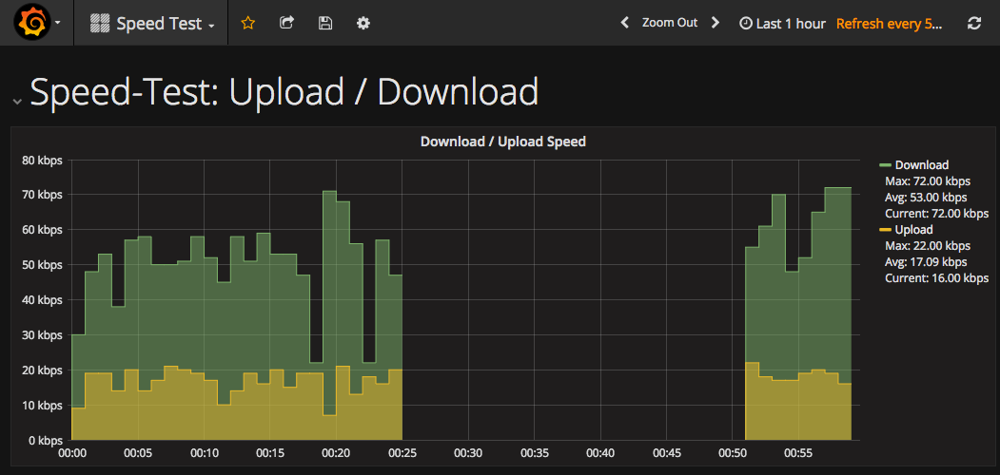

# speedy

> A very simplistic solution to track, monitor & analyze your internet speed & bandwidth.

## About

Your ISP promises great bandwidth and reliability to you, but you don't fully trust?
Then _speedy_ is the solutio for you. Get more insights what you actually get for the money you pay.



## Table of Contents

- [Features](#features)
- [Installation](#installation)
  * [Prerequisites](#prerequisites)
  * [Run it](#run-it)
  * [Configuration](#configuration)
  * [Reference Links](#reference-links)
- [Developing](#developing)
- [About](#about)
  * [Author](#author)
  * [Contributions](#contributions)
  * [License](#license)

_(TOC generated by [verb](https://github.com/verbose/verb) using [markdown-toc](https://github.com/jonschlinkert/markdown-toc))_

## Features

* Test the download & upload speed of your internet connection
* Save the results for historic analysis
* Ready to use dashboard to review the results

## Installation

### Prerequisites

* Docker (e.g. [Docker for Mac](https://docs.docker.com/docker-for-mac/) or [Docker for Windows](https://docs.docker.com/docker-for-windows/))

### Run it

Fork the repository:

```sh
$ git clone https://github.com/stefanwalther/speedy
```

Then run from the root directory:
```sh
$ docker-compose -d up
```

This will essentially spin up three Docker containers:

* **speedy** - Tiny node.js service to run a speed-test periodically (based on [speedtest-net](https://github.com/ddsol/speedtest.net).
* **InfluxDB** - Time series database to store the results from speedy, based on [InfluxDB](https://github.com/influxdata/influxdb).
* **Grafana** - Pre-Configured [Grafana](https://github.com/grafana/grafana) instance to visualize the results.

Access the resulting dashboard at:

* [http://localhost:3000/dashboard/db/speed-test](http://localhost:3000/dashboard/db/speed-test)

### Configuration

All configurations are stored in `configuration.env`.

* speedy - See [here](./docker/speedy/) for more details

### Reference Links

* Environment variables for InfluxDB: https://docs.influxdata.com/influxdb/v1.2/administration/config#environment-variables

## Developing

Run the development environment:

```sh
$ yarn dc-dev-up
```

The development differs as follows from the example above:

* Containers are build on demand (from the Dockerfiles)
* You can work on the source code in `./docker/speedy/src` and the solution will automatically get updated (using [nodemon](https://nodemon.io/)).

## About

### Author

**Stefan Walther**

* [github/stefanwalther](https://github.com/stefanwalther)
* [twitter/waltherstefan](http://twitter.com/waltherstefan)
* [stefanwalther.io](http://stefanwalther.io)

### Contributions

Contributions are always welcome. Just submit your PR.

### License

MIT